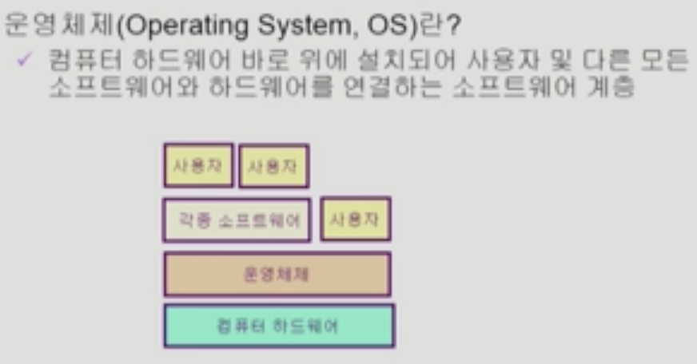

date: 2020년 11월 8일

이화여대 반효경 교수님 14년도 1학기 운영체제 강의

Introduction to Operating Systems

# 운영체제란?

하드웨어 바로 윗단에 설치되는 소프트웨어.

하드웨어는 하나의 고철덩어리. 사용자는 하드웨어만으로 컴퓨터를 쓸 수 없다. 그래서 운영체제가 필요하다. 두개가 한몸이 되서 하나의 컴퓨터 시스템이 된다. 다른 소프트웨어들도 운영체제의 관리를 받으면서 실행됨.

얘는 하드웨어와 사용자 연결 2가지 상호작용을 하게된다.

좁은의미: "커널"이라고 부른다. 운영체제의 핵심적인 부분. 컴퓨터 부팅 이후부터 항상 메모리에 상주하는 부분. 전공자 입장에서 운영체제를 말할땐 커널만을 의미하게 된다.

넓은의미: 커널 +@ 여러 주변 시스템 다루는 유틸리티를 포함한 개념으로 부른다.

# 운영체제의 목적

- **하드웨어를** 효율적으로 관리하는 역할. 컴퓨터 시스템의 **자원을 효율적으로 관리**.

  CPU, 기억장치, 입출력장치 등 하드웨어 리소스를 관리. 주어진 자원으로 최대한의 성능을 내도록(효율성)

- 또 **사용자가** 컴퓨터를 편리하게 사용할 수 있는 환경을 제공한다. 사용자간 형평성있는 자원분배

  프로세스, 파일, 메시지 등 소프트웨어 자원도 관리

  

  프로그램은 3개 있지만 자기 프로그램만 이 컴퓨터에서 실행되는 것 같은 인상. 내부적으로 동시에 실행되고 있음. cpu는 빠른 자원이다. 여러 프로그램이 동시에 실행될 때 cpu를 프로그램에 각각 할당하면서 유저가 느끼기엔 자기 cpu만 점유해서 쓰고있는 느낌을 준다.

  

# 운영체제의 분류

**동시작업이 가능한가?**

- 단일작업: 한번에 하나의 작업만 처리
- **다중 작업:** 동시에 두개 이상의 작업 처리. unix, MS windows. 현재의 운영체제는 거의 다 다중작업 처리

**사용자의 수?**

- 단일 사용자: MS-DOS, MS Windows
- **다중 사용자**: UNIX, NT server

여러사용자 계정을 만들어서 동시접근을 할 수 있는가?

보안, 사용자간 자원 형평성

**처리방식**

- 일괄처리(batch- processing): 작업 요청을 일정량 모아서 한꺼번에 처리. 작업이 완전 종료될때까지 기다려야 한다. 인터랙티브하지 않음. omr 카드 채점처럼 아주 옛날 컴퓨터 처리방식.
- **시분할(time sharing):** 현대 운영방식. 여러작업 수행될 때 여러작업 동시실행되지만 운영체제가 작은 시간단위로 나눠서 cpu를 나눠서 . 각 사용자는 인터랙티브한 빠른 응답 받게됨. 일괄처리보다 짧은 응답시간 가짐.
- 실시간(Realtime OS): 데드라인이 있다. 정해진 시간 안에 결과가 나오는 걸 보장해줌. 특수한 목적을 가진 시스템에서 사용한다. 원자로 공장 제어, 미사일제어, 반도체 장비 등에 사용된다.
  - Hard realtime system: 반도체 공장처럼 진짜 엄격한 경우
  - Soft realtime system: 영화, 멀티미디어 플레이.

# 컴퓨터 여러 작업 동시 수행 용어

**멀티태스킹**:

여러작업 동시 실행. cpu에선 매 순간 하나의 작업만 실행되고 있다. 그걸 짧은 시간간격으로 분할해서 할당하기 때문에 동시 실행처럼 보임.

**멀티 프로그래밍**:

메모리에 여러 프로그램이 동시에 올라가는 방식.

**타임 쉐어링**

시분할. cpu 시간 분할하여 나누어 쓴다

**멀티프로세스**

실행중인 프로그램. 동시에 실행된다.

유사한 용어로 사용된다. 우리는 수업때 이러한 기능을 추가해주는 운영체제를 배운다.

**멀티 프로세서**

프로세서는 보통 cpu를 말한다. cpu가 여러개 있는 컴퓨터를 멀티 프로세서라고 부른다. 다중 처리기.

위에 있는 용어들은 cpu가 하나있더라도 잘 나눠서 실행 반면에 멀티프로세서는 cpu가 여러개 있어야하는 하드웨어 환경이 다른 시스템이다(고성능 컴퓨터). 일반적인 운영체제는 cpu 1개 달린거.

# 운영체제의 예

### UNIX 계열

초기에 대형컴퓨터를 위해서 만들어졌다.

멀티태스킹 된다. 여러사용자 지원

초창기 어셈블리(기계어)로 만들다보니 코드 복잡. 유닉스 운영체제 만들기 위해 C언어를 새로 만듬. C언어는 기계가 이해하기 쉬운 고급언어다. 기계를 직접 다루는 운영체제 프로그래밍하기 좋음. 유닉스 커널은 대부분 C언어로 작성됨.

초반에 소스코드 공개. 공짜. 지금은 돈내고 팔지만. 여기서 공개 소프트웨어 정신에 입각해서 나온 운영체제 버전이 리눅스. 리눅스는 대형컴퓨터, 서버에 여러 사용자가 접속해서 사용할 수도 있지만 개인용으로도 사용 가능. 안드로이드도 운영체제 커널은 리눅스커널

프로그램 개발에 용이.

높은 이식성. portable. 기계어 집합이 전혀 다른 컴퓨터에 이식하기 쉽다. 컴퓨터에서 다시 컴파일 하면 되거든.

커널크기를 작게 만들어놨다. 최소한의 커널 구조. 그래서 확장성도 높다.

### MS Windows

개인용을 위해 만들어짐

단일사용자, 단일작업만 지원에서 출발 MS-DOS

소스코드 비공개. 만들어서 결과물 팔기만.

MS Windows: 다중 작업용 gui 기반 운영체제

ios등 운영체제 발전중

# 운영체제의 구조

각 자원들을 관리하는 것이 운영체제의 기본 기능

- CPU 관리 이슈: 어떤 프로그램에 CPU를 할당해줄까? CPU 스케쥴링. 선착순 처리는 효율적이지 않다는걸 컴퓨터는 알아. 작업들이 끝나고 안넘어오려고 하면 자원들을 효율적으로 활용할 수가 없어. CPU를 가장 짧게 사용할 프로그램에게 CPU를 주는게 좋다.
- 메모리 관리: 한정된 메모리를 어떻게 쪼개어 쓰지? CPU에서 실행이 될려면 최소한 메모리에 올라와있어야함. 프로그램이 너무 많아서 메모리를 지나치게 조금 갖고있다고 하면 전체 시스템이 원할하게 실행안됨. 일부 프로그램만 메모리 할당하고 전부 디스크로 쫓아냄. 무조건 n분의 1로 나눠주는것보다 그때그때 특정친구에게 집중하는 방법.
- 파일관리: 디스크에 파일을 어떻게 보관하지? 디스크 스케쥴링. 엘리베이터 스케쥴링과 유사. 먼저 누른 순서대로 처리하지 않고 디스크 헤드에 요청이 들어오면 원판에 가까운 순서대로 요청처리하지 않고 헤드가 이동하면서 같은 방향있는애들 처리하고감. cpu랑 디스크 스케쥴링은 스타일이 다르다. 헤드자체가 움직이면서 처리. 어떻게하면 움직임 최소화하며 많은 작업 처리할 수 있다. 택배 배달도 그렇다. 이동하는 순서를 정해놓고 움직인다. 어떻게 움직이는게 적게 움직이면서 빨리 처리할 수 있는가. 최대한 효율적으로
- I/O device: 입출력관리. 컴퓨터내부(Cpu,메모리) 등과 정보교환해야함. 인터럽트 기반해서 관리. cpu는 빠른 장치라 항상 자기일하고있음. io가 인터럽트로 cpu에게 알려줌. cpu가 최대한 중간에 방해받지 않도록
- 프로세스 관리: 자원 할당과 반납
- 보호시스템, 네트워킹, 커맨드라인 인터프리터

OS사용자 관점이 아니라 OS 개발자 관점에서 수강해야 한다.
