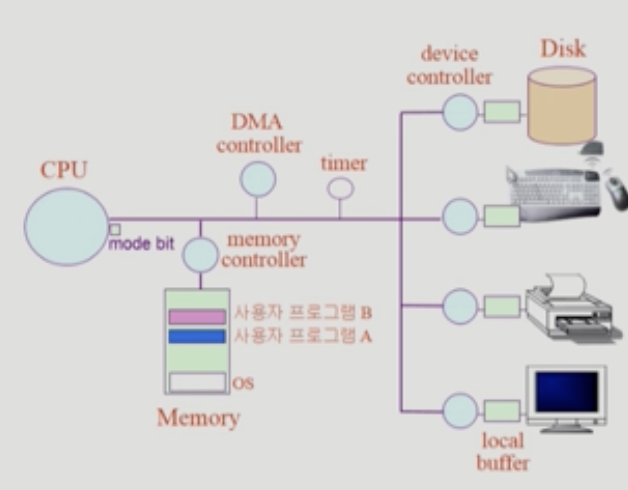
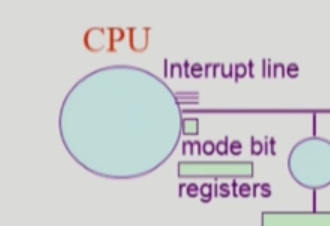
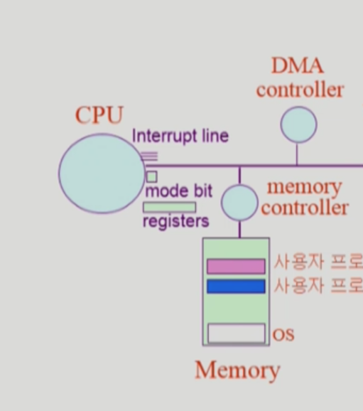

date: 2020년 12월 25일

System Structure & Program Execution 1

운영체제 공부에 앞서 하드웨어 설명

# 컴퓨터 시스템 구조

컴퓨터: cpu와 메모리로 구성됨

- 메모리: cpu의 작업공간.
- cpu: 매 순간마다 메모리에서 기계어를 읽어서 실행

i/o 디바이스: 인풋과 아웃풋으로 내보냄.

- 키보드, 마우스 : 인풋디바이스
- 프린트, 모니터: 아웃풋 디바이스
- 하드디스크: 보조기억장치. 메모리로 데이터를 읽어들이기도 하고 처리결과를 디스크에 파일시스템으로 저장하기도한다. 인풋과 아웃풋 디바이스 역할 동시 수행
- 각각의 io디바이스들은 작은 cpu같은게 붙음. **디바이스 컨트롤러**. 디스크에서 헤드가 어떻게 움직이고 어떤 데이터를 읽을지 내부통제는 이 디스크 컨트롤러가 담당.
- 각 디바이스들은 작업 공간이 필요하다. 로컬버퍼. 버퍼에다가 데이터를 받아서 처리하고 버퍼가 쌓이게되면 cpu가 거기 내용을 읽어서 자신의 작업영역인 메모리에 복사.

cpu와 io디바이스는 처리하는 속도, 성능차이가 많이 난다. cpu에 비해 디스크는 백만배정도 느림. 디스크를 cpu가 직접 관장하지 않고 디바이스 컨트롤러가 담당.

cpu의 역할은 평생 메모리에서 인스트럭션을 하나씩 읽어서 실행. 빠른 속도로 일만 함

cpu안에는 메모리보다 더 빠르면서 정보를 저장할 수 있는 작은 공간이 있다 ⇒ 레지스터

모드빗: cpu에서 사용되는게 운영체제인지 사용자 프로그램인지 구분해줌

인터럽트 라인: 요청끝냈다는걸 알려주기위함

디스크에서 뭘 읽어오라는 요청 보내기

인스트럭션 실행하다가 프로그램 a가 디스크에서 뭘읽어와야된다? 그럼 cpu가 직접 접근하는게 아니라 디바이스 컨트롤러에게 읽어오라고 시키고 디스크는 요청한 데이터를 읽어와서 (작업 오래걸림) 자신의 로컬버퍼에 집어넣음. 굉장히 빠른 cpu는 그동안 놀고있지 않고 또 메모리에 계속 접근하면서 인스트럭션을 실행한다.

근데 뭘 읽어오는지 확인하고 다음일을 해야하는거 아니야?

예를들어 키보드에서 뭘 읽어올게있으면 키보드 컨트롤러에게 시킴. 입력이 들어오는지 개의치 않고 자기가 할수있는 일을 계속 실행함.

그래서 프로그램이 여러개 실행될때 cpu는 왔다갔다 하면서 처리하게 되므로 빠르게 응답해주는것처럼 보임.

### 타이머

내가 작성한 프로그램으로 무한 루프를 작성하는 프로그램 만들수 있다. 계속 cpu만 쓰게

이 프로그램으로 cpu가 넘어가면, 계속 cpu만 쓰게됨. 그럼 cpu가 다른프로그램으로 넘어가지 못해서 타임쉐어링이 안되니까 컴퓨터안에는 타이머라는 하드웨어를 둔다.

처음에 컴퓨터키면 운영체제가 cpu를 갖고있다가 여러 프로그램 실행됨녀 프로그램에 cpu넘겨줌. 그냥넘겨주는게 아니라 타이머에 값 세팅하고 넘겨줌. 사용자프로그램은 독점적으로 계속 쓸수있는게 할당된 시간이 되면 cpu에 인터럽트를 걸어서 알려줌. cpu는 하나의 인스트럭션이 끝나고나면 인터럽트 라인을 체크한다. 인터럽트 들어온게 없으면 다음꺼실행하고. 인터럽트 들어오면 cpu의 제어권이 운영체제에게 자동으로 넘어간다

- 정해진 시간이 흐른 뒤 운영체제에게 제어권이 넘어가도록 인터럽트를 발생시킴
- 타이머는 매 클럭 틱 때마다 1씩 감소
- 타이머 값이 0이 되면 타이머 인터럽트 발생
- 특정 프로그램이 cpu를 독점하는걸 막기위함

사용자 프로그램은 직접 io장치에 접근할 수 없다. 모든 io디바이스 지시는 보안등의 이유로 운영체제를 통해서만 접근가능

io작업이 필요하면 프로그램 스스로 운영체제에게 cpu를 넘겨주고 운영체제가 해당하는 작업을 io컨트롤러에게 시킨다. 이제 읽어오는 작업은 오래걸리니까 운영체제는 프로그램에게 cpu넘겨주고

프로그램은 언제다시 cpu를 얻게되느냐. 키보드에서 뭘읽어와야지 그다음 처리할수있으니까 io컨트롤러가 요청한 작업이 끝나서 자신의 버퍼에 들어오면 cpu에게 인터럽트를 건다. 인터럽트가 들어오면 cpu가 자동으로 운영체제로 넘어가고 io입력된걸 확인하게됨. 입력된 값을 그 프로그램 메모리공간에 카피해주고, 일단 cpu쓰다가 인터럽트 당했던 애한테 타이머 남아있으면 다시 cpu넘겨줌

### Mode bit

- 사용자 프로그램의 잘못된 수행으로 다른 프로그램 및 운영체제에 피해가 가지 않도록하기위한 보호 장치 필요
- 하드웨어적으로 두가지 모드의 operation 지원
  - 1 사용자모드: 사용자 프로그램 수행
  - 0 모니터 모드: OS 코드 수행(=커널모드: 운영체제가 cpu에서 실행중일때)
    - 보안을 해칠 수 있는 중요한 명령어는 모니터 모드에서만 수행가능한 '특권명령'으로 규정
    - Interrupt나 Exception 발생시 하드웨어가 모드빗을 0으로 바꿈
    - 사용자 프로그램에게 cpu를 넘기기 전에 모드빗을 1로 세팅

### 디바이스 컨트롤러

- 해당 I/O 장치유형을 관리하는 일종의 작은 CPU
- 제어 정보를 위해 controll register, status register를 가짐
- 로컬버퍼를 가짐(일종의 data register)
- I/O는 실제 디바이스와 로컬버퍼 사이에서 일어남
- 디바이스 컨트롤러는 I/O가 끝났을 경우 인터럽트로 cpu에게 그 사실을 알림
- device driver(장치구동기): os 코드중 각 장치별 처리루틴 → 소프트웨어
- device controller(장치제어기): 각장치를 통제하는 일종의 작은 cpu → 하드웨어

인터럽트를 너무 많이 당하면 cpu같은 빠른 장치가 효율적으로 동작하지 않음. 그래서 DMA라는 컨트롤러를 하나 더 둔다.

직접 메모리에 엑세스할수있는 컨트롤러

이 메모리를 cpu도, DMA도 접근할 수 있게함

얘네 둘이서 특정 메모리 영역을 동시에 접근하면 문제생길 수 있어서 메모리 컨트롤러는 그걸 중재하는 역할 담당

cpu는 계속 자기일 하고 있고 중간에 로컬 버퍼에 들어오는 내용이 작업 끝나면 DMA가 그 내용을 메모리로 복사하는 작업까지 해줌. 그 작업 다 끝나면 cpu에 인터럽트를 걸어서 내용이 다 메모리에 올라왔습니다 보고해줌. 그럼 cpu가 중간에 인터럽트 당하는 빈도가 줄어서 빠른 cpu를 효율적으로 사용할 수 있게됨

### 입출력의 수행

- 모든 입출력 명령은 특권명령
- 사용자 프로그램이 io하는 방법
  - 시스템콜: 사용자 프로그램은 운영체제에게 io 요청
  - 트랩을 사용하여 인터럽트 벡터의 특정 위치로 이동
  - 제어권이 인터럽트 벡터가 가리키는 인터럽트 서비스 루틴으로 이동
  - 올바른 io 요청인지 확인 후 io 수행

### 인터럽트

- 인터럽트 당한 시점의 레지스터와 program counter를 save한 후 cpu의 제어를 인터럽트 처리 루틴에 넘긴다
- 넓은의미
  - interrupt(하드웨어 인터럽트): 하드웨어가 발생시킨 인터럽트
  - trap(소프트웨어 인터럽트)
    - Exception: 프로그램이 오류를 범한 경우
    - System call: 프로글매이 커널 함수를 호출하는 경우
- 인터럽트 벡터: 해당 인터럽트의 처리 루틴 주소를 갖고있음
- 인처럽트 처리 루틴: (= 인터럽트 핸들러) 해당 인터럽트를 처리하는 커널 함수
