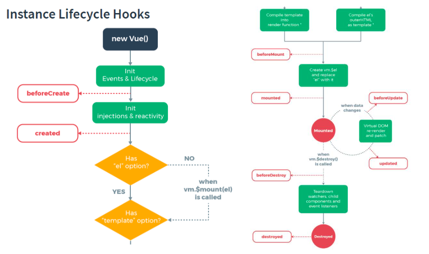

## 라이프사이클 메소드(hook)



### 1. Creation: 컴포넌트 초기화 단계

- 컴포넌트가 DOM에 추가되기 전 단계이다.
- DOM에 접근하거나 this.$el 사용 불가

**beforeCreate**

```jsx
beforeCreate:function() {
    console.log("beforeCreate", this);
  },
```

모든 hook에서 가장 먼저 실행. 아직 data와 event가 설정되지 않음.

**created**

```jsx
created:function() {
    console.log("created");
  },
```

- data와 event가 활성화되어 접근 가능
- 여전히 template과 DOM은 마운트 및 렌더링 되지 않은 상태


### 2. Mounting: DOM 삽입 단계

- 초기 렌더링 직전에 컴포넌트에 직접 접근 가능
- 초기 렌더링 직전에 DOM 변경하고자 한다면 이 단계에서 활용 가능.

**beforeMount**

```jsx
beforeMount:function() {
    console.log("beforeMount");
  },
```

- 템플릿과 렌더 함수들이 컴파일 된후에 첫 렌더링이 일어나기 전에 실행.
- 대부분의 경우에 사용 안함.

**mounted**

```jsx
mounted:function() {
    console.log("mounted1", this.$el, this.mesg);
    console.log("this.$el=====", this.$el);
    //data속성 값이 변경되면 자동으로 rendering됨
    this.mesg="happy로 변경"; //beforeupdated, update호출
    console.log("mounted2",this.mesg);
  },
```

- 컴포넌트,템플릿,렌더링된 DOM에 접근 가능
- 부모의 mounted hook이 자식의 mounted hook 보다 늦게 실행된다.
- 즉 부모는 자식의 mounted hook이 끝날때까지 기다린다.


### 3. Updating: Diff 및 재렌더링 단계

컴포넌트에서 사용되는 반응형 속성들이 변경되면 실행되는 단계.

**beforeUpdate**

```jsx
beforeUpdate:function() {
    console.log("beforeUpdate");
  },
```

- 컴포넌트의 데이터가 변경되어 업데이트 사이클이 시작될 때 실행.
- 정확히 DOM이 리렌더링되기 직전에 실행된다.
- 리랜더링 전의 새 상태의 데이터를 얻거나 더 많은 변경이 가능하다.

**updated**

```jsx
beforeUpdate:function() {
    console.log("beforeUpdate");
  },
```

- 컴포넌트의 데이터가 변경되어 재 렌더링이 일어난 후에 실행.
- DOM이 업데이트가 완료된 상태이기 때문에 DOM 종속적인 연산 가능.
- ( 여기서 상태 변경시 무한루프에 빠질 수 있다. )


### 4. Destruction: 해체단계

**beforeDestroy**

```jsx
beforeDestroy:function() {
    console.log("beforeDestroy");
  },
```

- 뷰 인스턴스가 제거되기 직전에 실행.
- 이벤트 리스너 제거 작업 가능.

**destroyed**

```jsx
destroyed:function() {
    console.log("destroyed");
  },
```

- 뷰 인스턴스가 제거된 후에 실행.
- 모든 디렉티브가 바인딩 해제되고 모든 이벤트 리스너가 제거됨.
- 모든 하위 뷰 인스턴스도 제거됨.

### 중첩컴포넌트 라이프사이클


