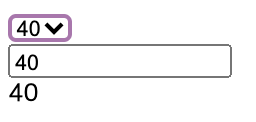
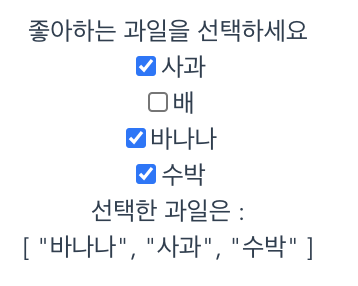
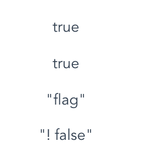
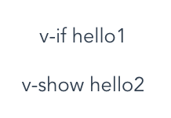
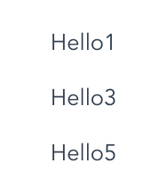
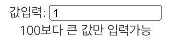
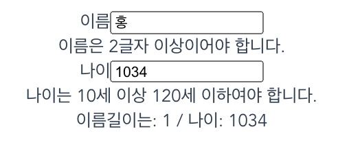
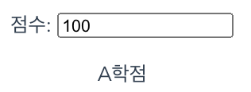
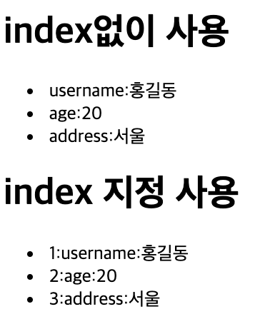
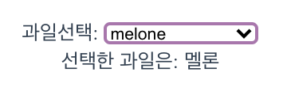

### 09_directive_03_v_model2_select



```jsx
<template>
  <div class="hello">
    <select v-model="mesg">
      <option>10</option>
            <option>20</option>
            <option>30</option>
            <option>40</option>
    </select><br>
    <input type="text" v-model="mesg"><br>
    {{mesg}}
  </div>
</template>

<script>
export default {
  name: 'HelloWorld',
  props: {
    msg: String
  },
  data:function(){
    return{
      mesg:20
    }
  }
}
</script>
```

### 09_directive3_v-model3_heckbox



```jsx
<template>
  <div>
    <div>좋아하는 과일을 선택하세요</div>
    <input type="checkbox" v-model="fruit" value="사과">사과<br>
    <input type="checkbox" v-model="fruit" value="배">배<br>
    <input type="checkbox" v-model="fruit" value="바나나">바나나<br>
    <input type="checkbox" v-model="fruit" value="수박">수박<br>
    선택한 과일은 :<br>
    {{fruit}}
  </div>
</template>

<script>
export default {
  name: 'HelloWorld',
  props:{
    mesg:String,
  },
  data: () => ({fruit:[]})
}
</script>
```

## v-show, v-if

- v-if는 조건에 일치하지 않으면 렌더링 안됨. 조건에 따라 컴포넌트가 실제로 제거되고 생성된다.
- v-show는 랜더링은 되지만 화면에 안보임. css 의 display 속성만 변경

### v-show



```jsx
<template>
  <div>
    <div>
      <!-- v-show는 앵귤러의 ngIf와 비슷함. display:none 속성으로 작동 -->
      <p v-show=true>true</p>
      <p v-show="true">true</p>
      <p v-show="flag">"flag"</p>
      <p v-show="! false">"! false"</p>
      <p v-show="false">"false"</p>
      <p v-show=false>false</p>
      <p v-show="! true">"! true"</p>
    </div>
  </div>
</template>

<script>
export default {
  name: 'HelloWorld',
  props:{
    mesg:String,
  },
  data: () => ({flag:true})
}
</script>
```

### v-if



```jsx
<template>
  <div>
    <div>
      <!-- v-if는 조건에 일치하지 않으면 렌더링 안됨
           v-show는 렌더링은 되지만 화면에 안보임 -->
      <p v-if="amount==1">v-if hello1</p>
      <p v-show="amount==1">v-show hello2</p>
      <p v-if="amount!=1">v-if hello3</p>
      <p v-show="amount!=1">v-show hello4</p>
    </div>
  </div>
</template>

<script>
export default {
  name: 'HelloWorld',
  props:{
    mesg:String,
  },
  data: () => ({amount:1})
}
</script>
```

### 9-4_3



```jsx
<template>
  <div>
    <p v-if="3>1">Hello1</p>
    <p v-show="num>=num2">Hello2</p>
    <p v-if="num<num2">Hello3</p>
    <p v-show="num>num2 && 3==3">Hello4</p>
    <p v-show="num<num2 || 3==3">Hello5</p>
  </div>
</template>

<script>
export default {
  name: 'HelloWorld',
  props:{
    mesg:String,
  },
  data: () => ({num:1, num2:5})
}
</script>
```

### 9-5 실습4



```jsx
<template>
  <div>
    <h1>{{msg}}</h1>
    값입력: <input type="text" v-model="amount">
    <span v-if="amount < 100">100보다 큰 값만 입력가능</span>
  </div>
</template>

<script>
export default {
  name: 'HelloWorld',
  props:{
    msg:String,
  },
  data: () => ({amount:100})
}
</script>
```

### 9-5 실습5



```jsx
<template>
  <div>
    이름<input type="text" v-model="username"><br>
    <span v-if="username.length<2">이름은 2글자 이상이어야 합니다.</span><br>
    나이<input type="text" v-model="age"><br>
    <span v-if="age<10||age>120">나이는 10세 이상 120세 이하여야 합니다.</span><br>
    이름길이는: {{username.length}} / 나이: {{age}}
  </div>
</template>

<script>
export default {
  name: 'HelloWorld',
  props:{
    msg:String,
  },
  data: () => ({username:'홍길동', age:10})
}
</script>
```

9-6 v-else-if



```jsx
<template>
  <div>
    <!-- v-if, v-else-if, v-else의 사용 -->
    점수: <input type="text" v-model.number="grade">
    <p v-if="grade>90">A학점</p>
    <p v-else-if="grade>80">B학점</p>
    <p v-else-if="grade>70">C학점</p>
    <p v-else>F학점</p>
  </div>
</template>

<script>
export default {
  name: 'HelloWorld',
  props:{
    msg:String,
  },
  data: () => ({grade:50})
}
</script>
```

## 9-7 v-for array

`v-for=“항목 in 배열|객체”`



```jsx
<template>
  <div>
    <!-- v-for 객체의 사용 -->
    <h1>index없이 사용</h1>
    <ul>
      <li v-for="(value, key) in person" :key="key">
        {{key}}:{{value}}
      </li>
    </ul>
    <h1>index 지정 사용</h1>
    <ul>
      <li v-for="(value, key, index) in person" :key="index">
        {{index+1}}:{{key}}:{{value}}
      </li>
    </ul>
  </div>
</template>

<script>
export default {
  name: 'HelloWorld',
  props:{
    msg:String,
  },
  data: () => ({
    person:{
      username:'홍길동',
      age:20,
      address:'서울'
    }
  })
}
</script>
```

### 9-8_v-for_object



```jsx
<template>
  <div>
    <!-- v-for 객체의 사용 -->
    과일선택:
    <select v-model="result">
      <option disabled selected>과일을 선택하세요</option>
      <option v-for="(value, key, index) in fruits" :key="index"
      :value="value">{{key}}</option>
    </select><br>
    선택한 과일은: {{result}}
  </div>
</template>

<script>
export default {
  name: 'HelloWorld',
  props:{
    msg:String,
  },
  data: () => ({
      fruits:{
        apple:'사과',
        banana:'바나나',
        melon:'멜론'
      },
      result:''
  })
}
</script>
```

## template 태그

- 하나의 요소가 아닌 여러 요소를 그룹핑 하여 반복처리 하기 위한 방법.
- template 태그는 DOM으로 흔적을 남기지 않는다. –크롬 개발자도구
- element 확인

```jsx
<template>
  <div class="hello">
    <h1>1.기본</h1>
    <div v-for="(name, idx) in names" v-bind:key="idx+10" id="01">{{name}}님</div>
    <h1>2.div태그로 그룹핑:div 태그가 흔적으로 남음 </h1>
    <div v-for="(name, idx) in names" v-bind:key="idx+100" id="02">
      <span>{{name}}</span>
      <span>님</span>
    </div>
    <h1>3.template태그로 그룹핑: temlate태그가 흔적으로 안남음</h1>
   <template v-for="(name, idx) in names" id="03">
     <span v-bind:key="idx+1"><!--반복-->
       {{name}}님
     </span>
     <span :key="idx+20"></span><br :key="idx+50"><!--반복-->
   </template>
  </div>
</template>
<script>
export default {
  name:"HelloWorld",
  props:{
    msg:String
  },
  data:function(){
    return{
      names:['홍길동','이순신','유관순']
    }
  }
}
</script>
```

idx는 왜저러고있는지모르겠다

v-for가 지금 3개나 사용되고있는데 얘네들이 똑같이 names 배열을 사용하잖아. 그래서 도출된 결과도 각각의 고유값을 갖고있어야 한다. 그래서 중복되지 앟으려고 어떤애는 10부터 시작해서 뽑아내고 어떤애는 100부터 시작해서 뽑아내고 한거다.

### 9-7_v-once

- HTML 요소를 단 한번만 랜더링 하도록 설정
- Data 속성값이 변경되어도 다시 랜더링 하지 않는다.

```jsx
<template>
  <div class="hello">
      기본:<span>{{username}}</span><br>
      v-once사용안함<span>{{username}}</span><br>
      v-once사용<span v-once>{{username}}</span><br>
      {{changeName()}}
  </div>
</template>

<script>
export default {
  name: 'HelloWorld',
  props:{
    msg:String,
  },
  data: () => ({ username:'홍길동' }),
  methods: {changeName: () => this.username='이순신'}
}
</script>
```

v-once 가진 애는 처음 렌더링 되고 값이 변경되도 리렌더링 안됨

### 9-9 v-model, v-for 실습6

```jsx
<template>
  <div>
    <h1>교재정보</h1>
    <div v-for="(book, idx) in bookList" :key="idx">
      <input type="checkbox" v-model="books" :value="book">{{book.name}}
      <span>{{book.price}}</span>
    </div>
  <hr>
  선택교재
  <div v-for="(book, i) in books" :key="i+100">{{book.name}}</div>
  <hr>총합:{{total}}
  </div>
</template>

<script>
export default {
  name: 'HelloWorld',
  props:{
    msg:String,
  },
  watch:{  // watch 선언
    books:function() { // watch는 반드시 변수명과 메소드명을 일치시켜야함. books가 변경될때 실행됨
      console.log('watch실행=======');
      let xxx = 0; // 총합변수
      let kkk = this.books; // 선택한 책목록 저장
      kkk.map((ele, idx) => {  // 콜백함수
        console.log(idx, ele.name, ele.pric);
        xxx = xxx + ele.price; // 총합에 누적
      });
      this.total = xxx; // 총합변수에 최종 저장
    }
  },
  data: () => ({
    bookList:[
       {name:'자바의 정석', price:30000},
       {name:'jsp 정석', price:40000},
       {name:'Spring 정석', price:50000},
       {name:'jQuery 정석', price:60000},
       {name:'Angluar 정석', price:70000},
     ],
     books:[], // 선택한 책 저장
     total:0 // 총 가격 저장
   }),
}
</script>
```

체크박스에서 여러항목에 똑같은 v-model 지정해주면 그 속성값으로 출력해줄 수 있었다. 여기서는 그 속성값 또한 반복문해주고있음. v-model로 books 배열을 바인딩 해줬다. 이 체크박스에서 체크가 발생되면 자동으로 books 배열에 값이 입력된다.

books에 변화가 생겼으니 watch에 있는 books 함수도 작동한다. books를 반복해서 총합변수에 가격을 합산하고 data에 있는 total 값을 여기서 더한 토탈값으로 지정해준다.

이제 {{books}}하면 화면에 찍히는데 걔도 반복문으로 보여주고있다.

## computed속성(계산형속성)

- methods와 기능은 동일하나 속성처럼 사용 가능 `{{속성명}}`으로 사용함
- methods와 다르게 데이터 캐싱 처리가 가능. 한번만호출됨

```jsx
<template>
  <div>
    값:{{num}}<br>
    {{xxx()}}{{xxx()}}{{xxx()}}<br>
    {{yyy}}{{yyy}}{{yyy}}
    {{change()}}
  </div>
</template>
```

```jsx
<script>
export default {
  name: 'HelloWorld',
  props:{
    msg:String,
  },
  data: () => ({num:30}),
  // 기본적으로 함수는 매번 호출됨
  methods:{
    xxx:function() {
      console.log("xxx methods호출됨========", this.num);
    },
    change:function(){
      this.num = 40;
    }
  },
  // computed 속성은 method와 동일하나 속성처럼 사용가능 {{속성명}},
  // 데이터 캐싱처리 되어 한번만 호출됨
  computed:{
    yyy:function() {
      console.log("yyy computed호출됨======", this.num);
      return ""; // 리턴값 필요함
    }
  }
}
</script>
```

data 속성값이 변경되면 애네들도 그때마다 다시 호출됨.

## watch속성(관찰속성)

- 주로 긴 시간을 필요로 하는 비동기 처리에 주로 사용
- 데이터가 변경되었을 때 함수가 자동 호출 된다.( methods 및 computed 함수는 명시적으로 호출해야 된다. )
- 반드시 함수명과 data 속성명이 일치해야 된다.

```jsx
<template>
  <div>
    <h1>watch 속성</h1>
    값: <input type="text" v-model="num"><br>
    변경된값: {{num}}
  </div>
</template>

<script>
export default {
  name: 'HelloWorld',
  props:{
    msg:String,
  },
  // watch의 사용은 변수명과 함수명이 동일해야함
  data: () => ({num:10}),

  // 1. 함수명과 데이터 변수명이 동일해야 함
  // 2. 데이터 속성이 변경되면 method와 computed는 명시적으로 호출해야 하지만
  // 3. watch는 자동으로 호출됨
  watch:{
    num:function(changeValue){
      console.log('watch 함수 실행: ', this.num, '\t', changeValue);
    }
  }
}
</script>
```

- methods 는 명시적으로 호출하고 캐시기능 없다.data 속성값 변경시 호출된다. ( data 속성값 사용여부 무관)
- computed는 명시적으로 속성형태로 사용하고 캐시기능 있다. data 속성값 변경시 호출된다. ( data 속성값 반드시 사용)
- watch는 data 속성명과 동일한 함수를 작성하여 데이터 변경시 자동으로 호출된다. 명시적으로 호출하지 않는다.
